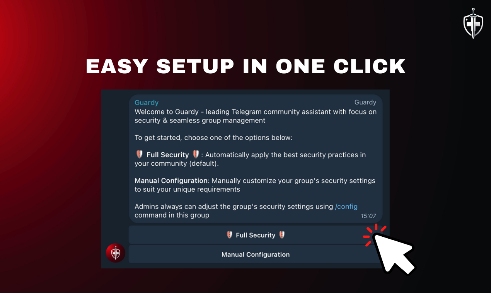
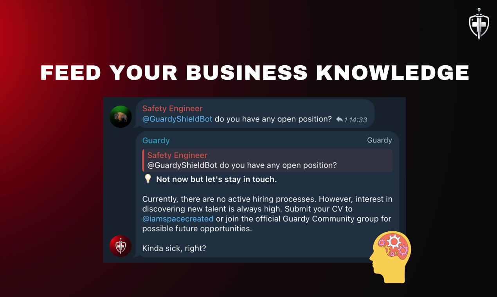
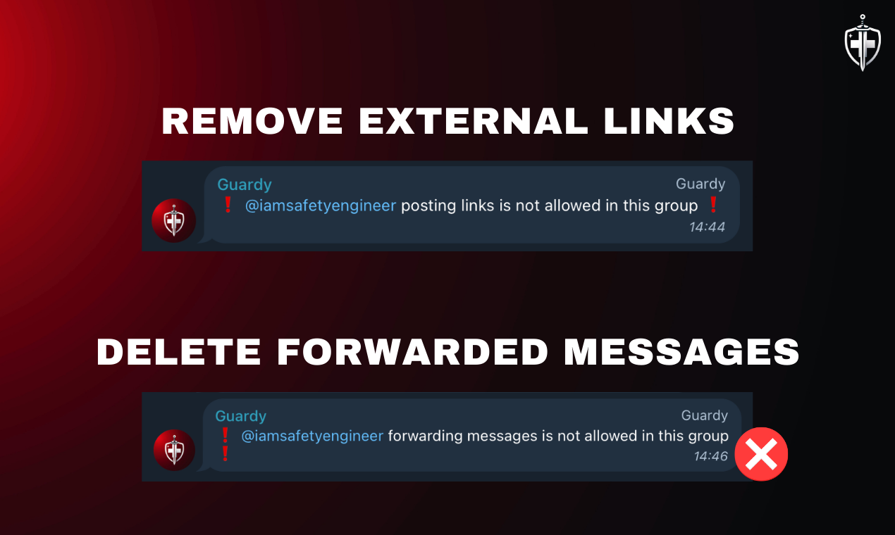
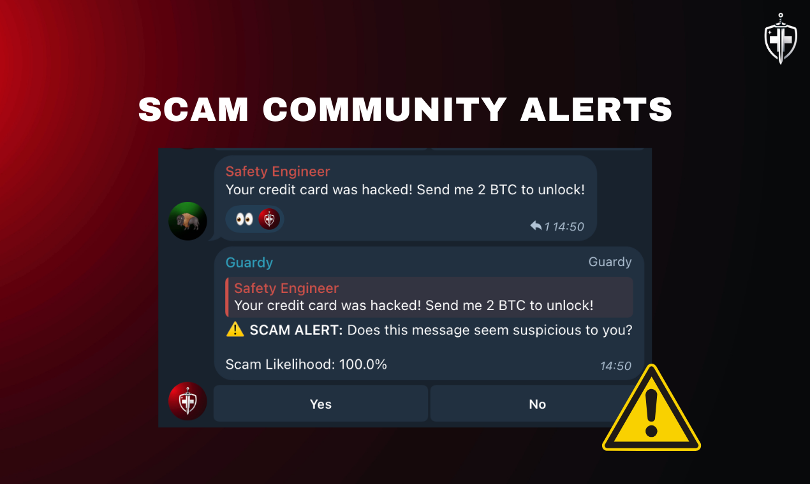
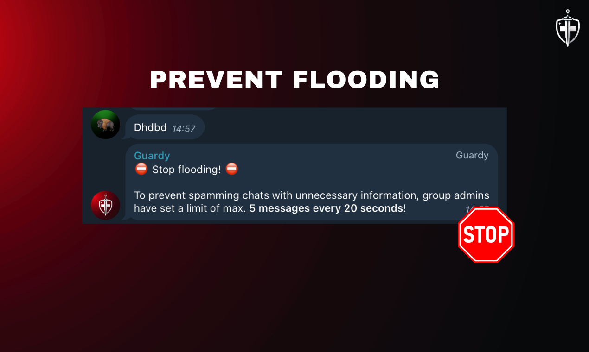

# Guardy

Guardy is a robust Telegram bot designed to enhance the security and management of Telegram groups. It includes features such as user verification, link removal, anti-flood protection, and more.

## Disclaimer

This repository is for educational purposes only. Before deploying Guardy, many changes should be made to ensure security and proper functionality. Cybernetica Labs does not take any responsibility for the code if it is pushed into production without appropriate modifications.

## Features

- **User Verification**: Supports CAPTCHA and WEB-based user verification to ensure only real users can join the group.
- **Link Removal**: Automatically removes external links posted by non-admin members to reduce spam.
- **Anti-Flood**: Mutes users sending excessive messages within a given period.
- **Bot Management**: Automatically removes external bots.
- **Community Votes**: Identifies and flags potentially scam messages for community review.

## Commands

Guardy offers a diverse command set accessible in both private chats and public groups.

### Private Commands (Available to everyone in a private chat)

- `/start` - Quick start guide.
- `/setup` - List all available commands.
- `/examples` - Small examples of Guardy's capabilities.
- `/features` - List all Guardy's FREE and PREMIUM features.
- `/help` - Access 24/7 help center.

### Group Commands (Admins)

- `/config` - Manage & customize group security settings.
- `/disable` - Disable Guardy & turn off all group security settings.
- `/enable` - Enable Guardy & turn on maximum security settings.

### Group Commands (All)

- `/adminlist` - List all admins in the current chat.
- `/rules` - List all rules in the current chat.

## Usage Examples

Below is a detailed guide on what you can accomplish with Guardy:

1. **Send any link to the group**. It will be automatically removed to ensure security and prevent scams/spam.
   - Example: www.youtube.com
2. **Try sneaking an external bot into the group**. It will be automatically removed.
3. **Try forwarding any message from outside the chat**. See it disappear before causing any harm.
4. **Imagine you are a scammer and send a malicious message to the group**. A community voting process will initiate, and a democratic community vote decides its fate.
   - Example: Congratulations 🎉 You've won $1,000,000 in the Global Lottery. Claim your prize in our Telegram group ASAP!
5. **Ask anything about Guardy himself via @GuardyShieldBot**.
   - Example: @GuardyShieldBot who is your main developer?

## Setup

### Prerequisites

- Telegram API key
- MongoDB
- OpenAI API key
- OpenAI Assistant (incl. your custom system prompt, knowledge base, etc.)

### Installation

1. **Clone the repository:**

    ```bash
    git clone https://github.com/cybernetica-labs/guardy.git
    cd guardy-bot
    ```

2. **Create a `.env` file in the root directory and add your configuration:**

    ```dotenv
    ENVIRONMENT=test 
    
    OPENAI_API_KEY=''
    OPENAI_GUARDY_ASSISTANT_ID=''
    OPENAI_GUARDY_ASSISTANT_API_KEY=''
    
    GUARDY_BOT_API_KEY=''
    GUARDY_ID=''
    GUARDY_URL=''
    GUARDY_USERNAME=''
    
    GUARDY_TEST_BOT_API_KEY=''
    GUARDY_DEV_URL=''
    GUARDY_DEV_USERNAME=''
    GUARDY_DEV_ID=''
    
    MONGO_DOADMIN_PASSWORD=''
    MONGO_DOADMIN_USERNAME='' 
    
    MONGO_DB_CONNECTION_STRING=''
    MONGO_PASSWORD=''
    MONGO_USERNAME=''
    MONGO_HOST=''
    MONGO_DB=''
    ```

3. **Build and run the Docker container:**

    ```bash
    docker-compose up --build
    ```

## Deploy

Guardy must be deployed to a server to run continuously. You can deploy Guardy on various cloud service providers like AWS, Azure, Google Cloud, or DigitalOcean. Ensure that your server has Docker and Docker Compose installed.

## Important Notes

To ensure the security and proper functioning of your Telegram bot, a couple of best practices before deploying in production:

- **Use a `.dockerignore` file** to keep the build context clean and secure. Exclude unnecessary files that could expose sensitive information.
- **NEVER hard-code API keys or other sensitive data** in your code. Use environment variables and secure vaults to manage sensitive information.
- **Encrypt sensitive data** both at rest and in transit. Use HTTPS for all communications and consider encrypting data stored in your database.
- **Limit permissions and access** to only those who need it. Use role-based access controls to manage user permissions effectively.
- **Implement logging and monitoring** to detect and respond to security incidents promptly. Monitor your bot for unusual activity.
- **Regularly review your code** and conduct security audits to identify and fix vulnerabilities.
- **Implement data retention policies** to manage the lifecycle of the data your bot collects. Ensure compliance with data protection regulations in your region.

## Screenshots



<table>
  <tr>
    <td></td>
    <td></td>
  </tr>
  <tr>
    <td></td>
    <td></td>
  </tr>
</table>

## License

This project is licensed under the MIT License. See the [LICENSE](LICENSE) file for details.